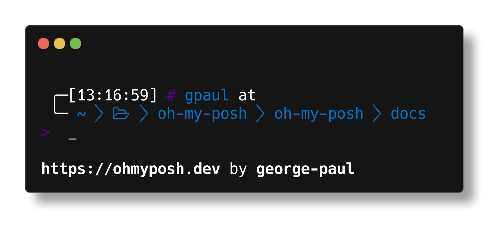

# posh-donatello

Custom theme for the shell theming engine [oh-my-posh](https://ohmyposh.dev/).

Configure your shell to use this theme by following [this](https://ohmyposh.dev/docs/windows) guide.

Enjoy!

## Preview

